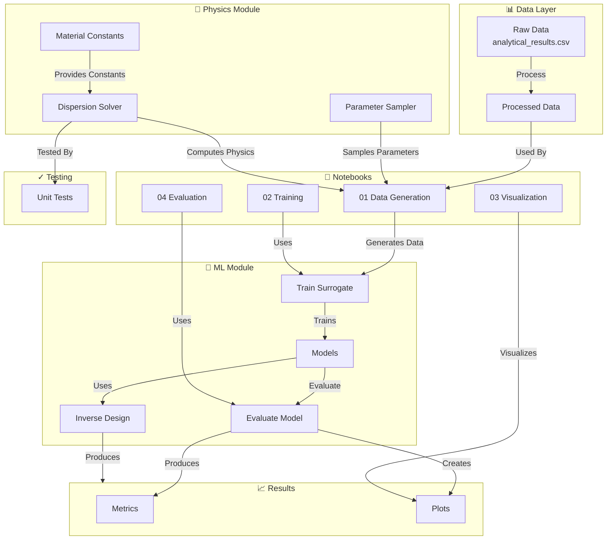

# SH Wave ML Surrogate - Architecture Diagram

## System Architecture

## Component Overview

### Data Layer
- **Raw Data**: Input from `analytical_results.csv`
- **Processed Data**: Cleaned and formatted data for training

### Physics Module
- **Dispersion Solver**: Computes wave dispersion characteristics
- **Material Constants**: Provides material properties
- **Parameter Sampler**: Generates parameter samples for data generation

### ML Module
- **Models**: Neural network surrogate models
- **Train Surrogate**: Training pipeline for surrogate models
- **Evaluate Model**: Model evaluation and metrics calculation
- **Inverse Design**: Inverse problem solving using trained models

### Notebooks
Sequential workflow notebooks for the complete pipeline:
1. Data Generation
2. Model Training
3. Results Visualization
4. Comprehensive Evaluation

### Results
- **Metrics**: Performance metrics and evaluation results
- **Plots**: Visualization outputs

### Testing
- **Unit Tests**: Validates physics computations
